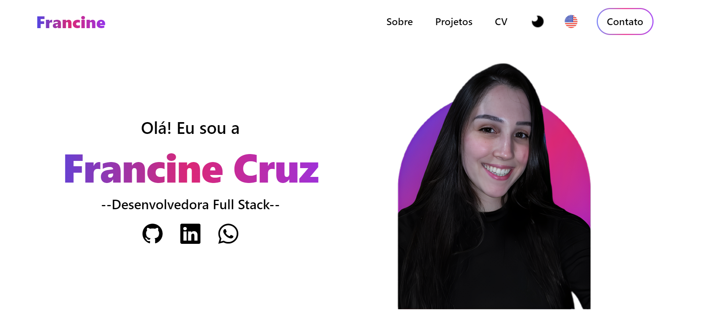
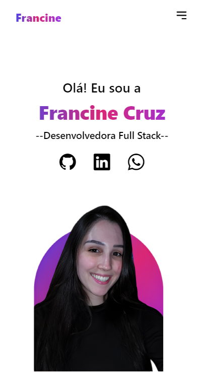

<h1 align="center"> 
  🎨 
   
  Portfólio pessoal - Francine Cruz
  

    
    
    
  

</h1>

**Bem-vindo ao meu portfólio!** 

Aqui você encontrará uma visão geral dos projetos que desenvolvi e das habilidades que adquiri como desenvolvedora full stack. Este repositório é uma amostra do meu trabalho e um reflexo do meu compromisso.

## 🖼️  Visualização:

    

## 🚀  Tecnologias 
-  Estruturação das páginas e componentes.  
-  Estilização para uma interface visual agradável.  
-  Para interatividade e funcionalidades dinâmicas.  
-  Biblioteca principal para construção da interface do usuário com hooks como `useState` e `useEffect`.  
-  Ícones prontos para uso em componentes.  
-  Framework de CSS para estilização responsiva e otimizada.  
-  Biblioteca para animações elegantes e interativas.  
-  Integração de envio de emails diretamente do frontend.  
-  Efeitos de scroll animados para uma experiência dinâmica.  
-  Internacionalização para suporte a múltiplos idiomas.  
-  Ferramenta para desenvolvimento frontend rápido e eficiente.

## 🌐 Contato

- 📧  **Email:** [francine.c.oliveiracruz@gmail.com](mailto:francine.c.oliveiracruz@gmail.com)
- 💻 **LinkedIn:** [Francine Cruz](https://www.linkedin.com/in/francine-ccruz/)
- 📱 **Telefone:** +55 51 98628-3397

🤝 Sinta-se à vontade para entrar em contato para colaborações, oportunidades de trabalho ou apenas para bater um papo sobre tecnologia!

---

🩷 Obrigado por visitar meu portfólio! 🩷

